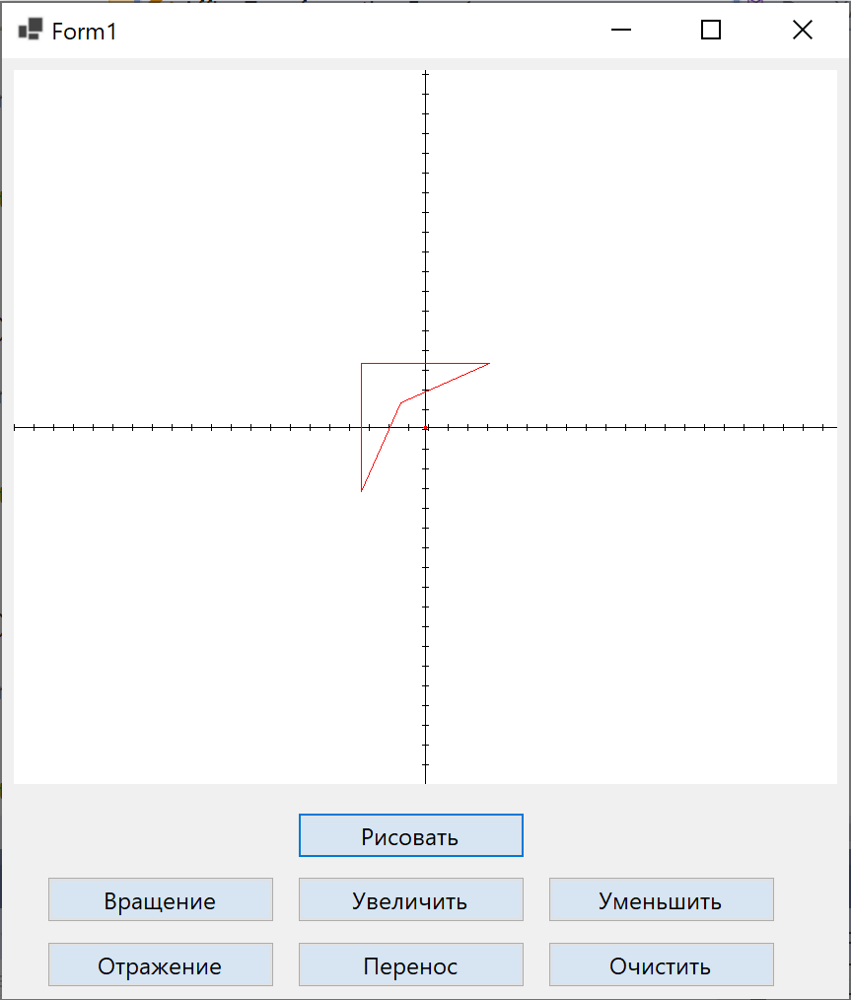
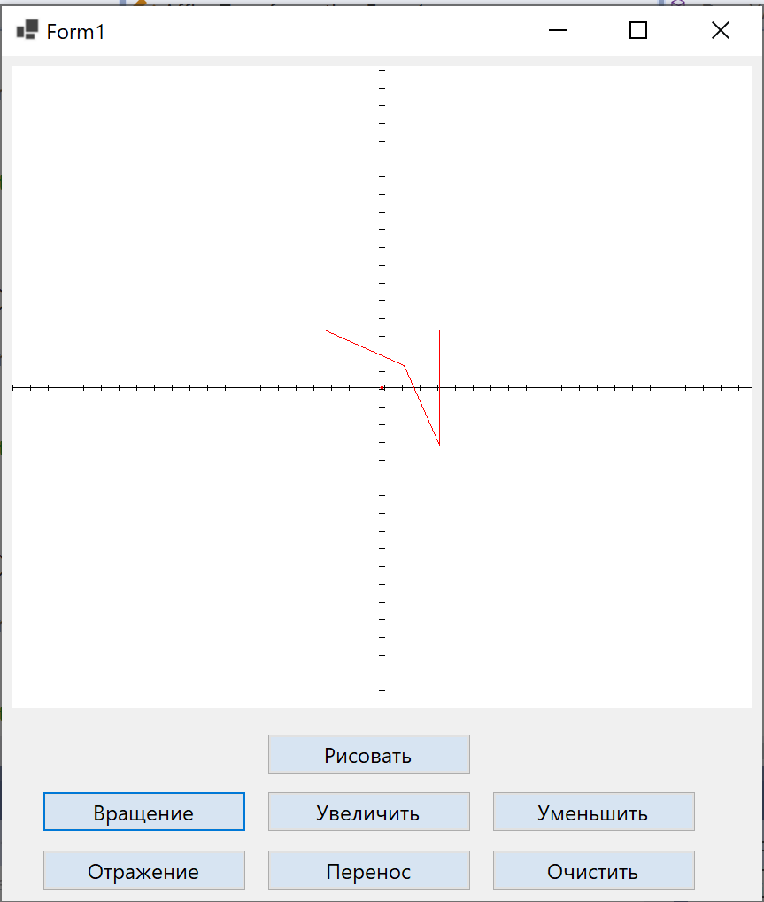
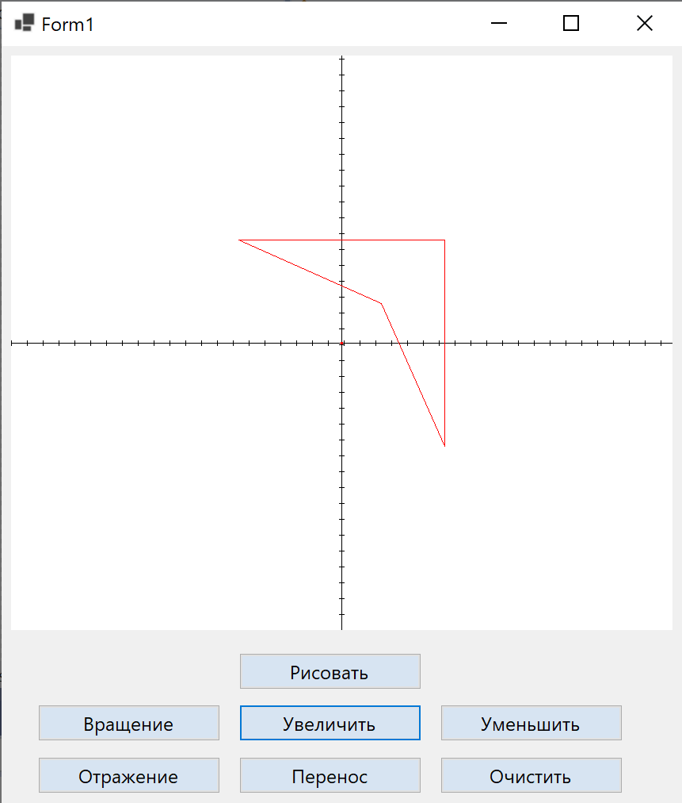

# AffineTransformation
A simple windows forms program to apply affine transformations to a given figure. The program can do the following:
* **Draw** a given figure.
* **Return** a figure to its intitial position.
* **Rotate** a figure by transformation.
* **Scale up** a figure by transformation.
* **Scale down** a figure by transformation.
* **Reflect** a figure by transformation.
* **Transfer** a figure by transformation.

## Technologies used in this project:

 

## Info:
An affine transformation is any transformation that preserves collinearity (i.e., all points lying on a line initially still lie on a line after transformation) and ratios of distances (e.g., the midpoint of a line segment remains the midpoint after transformation).

The project should be opened in **Microsoft Visual Studio**. Simply compile the project and run it. You will be presented with an interface.

Click on "рисовать" and the figure will be drawn.

  

We can rotate the figure by clciking on rotate button "вращение".

  

We can Scale up the figure by clciking on the button "Увеличить".

  

Similarly other transformation can also be applied.

 

## Note

Feel free to download the project and build upon it. Happy coding!
